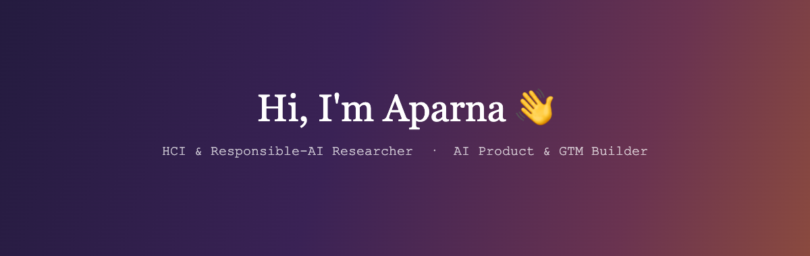

### Aparna Sharma
**HCI & Responsible-AI Researcher · AI Product & GTM Builder**

I study how technology shapes people — and I build the products that reach them.

---

### 🔬 The researcher

A lot of my research is private. My work asks how technology changes the people who use it — across social platforms, AI systems, and assistive robotics.

- Six peer-reviewed papers · 122 citations · h-index 3
- IEEE Best Paper Award, cited in elderly-care policy across four countries
- Lead author on a social-media & mental-health study cited 100+ times

### 🛠️ The builder

I take GenAI products from zero to real users, and run go-to-market for enterprise clients.

- GenAI product launches from 0 → 10,000 users
- GTM for $500M ARR enterprise clients
- Founding-team work building AI products that ship

---
### Research interests

My work sits at the intersection of human-computer interaction, responsible AI, and human wellbeing — how technology reshapes the people who live with it, and how to build it responsibly. Three threads run through it:

- **Technology and mental health** — how platform design relates to psychological wellbeing, most centrally in my lead-authored study on Instagram and mental health
- **Assistive and care technology** — where robotics and AI can genuinely support aging populations, and where deployment outpaces evidence
- **Responsible AI in practice** — not as principle, but as engineering: systems with human oversight built into the loop, evaluated honestly

I don't keep research and building in separate boxes. The research makes me a better builder. The building keeps my research honest.

### Publications

| Year | Paper | Status |
|---|---|---|
| 2026 | Who You Are Changes What You're Told: Red-Teaming Personalized Safety Failures in Frontier LLMs | In progress · lead |
| 2026 | A Comparative Review of GPT-5, BERT, Gemini, and DeepSeek Large Language Models | Accepted |
| 2025 | AI-Powered Software Development: Enhancing Productivity and Code Quality | In progress · lead |
| 2022 | The Impact of Instagram on Young Adults' Social Comparison, Colourism and Mental Health *(Elsevier, IJIM Data Insights)* | Published · lead · 100+ citations |
| 2021 | A Systematic Review of Assistance Robots for Elderly Care *(IEEE ICCICT)* | Published · lead · IEEE Best Paper |
| 2021 | Perception of Students in Online Tests in Engineering *(IEEE ICCICT)* | Published · lead |
| 2020 | Innovative Course Delivery using the AGDO Methodology *(ASTESJ)* | Published · lead |

### Focus areas

### Socials

---

### 📌 Pinned work

- **From Stadium to Streets** — a data-driven policy proposal on LA's public restroom gap
- **Senior Citizen Assistance Humanoid** — mood-aware, voice-controlled care robot
- **IoT Health Monitoring System** — real-time biosensor dashboard
- **Life-Centered Financial Modeling** — 20-year net-worth simulation

